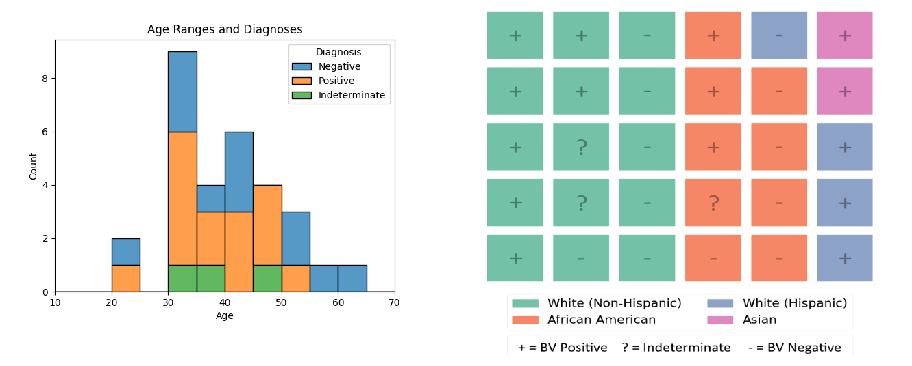
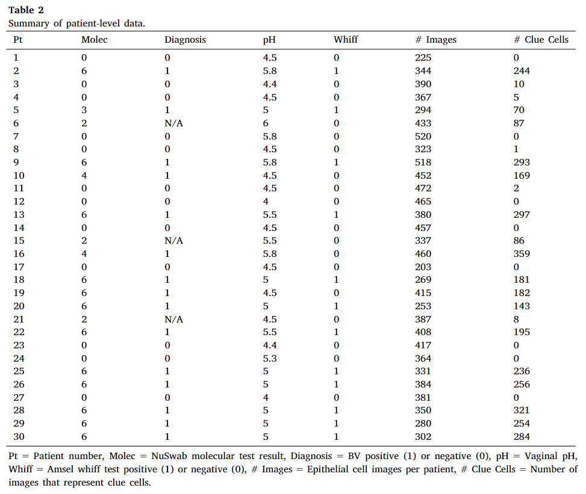
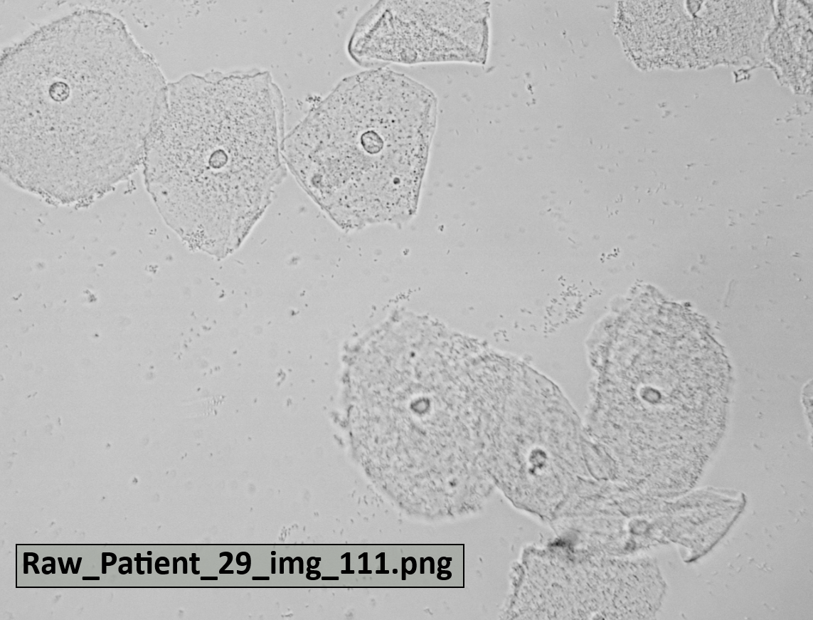
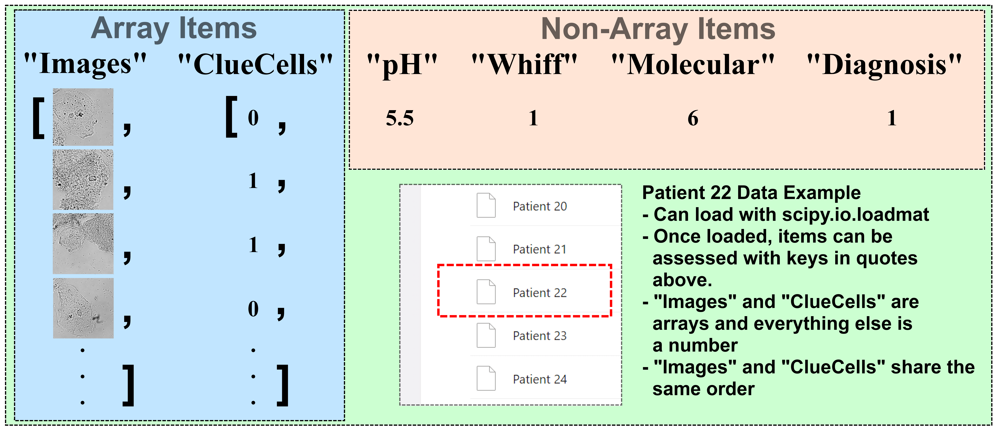

This page describes and links to a dataset of 30 patients tested for bacterial vaginosis (BV). For each patient, we provide slide images of vaginal microbiota that have corresponding labels of clue cell status as determined by a physician alongside Amsel criteria test values and the patient's diagnosis.

## Cite the Paper

Utilize the following citation if using this dataset:

> Highland and Zhou, Amsel criteria based computer vision for diagnosing bacterial vaginosis, Elsevier Smart Health 2024, https://doi.org/10.1016/j.smhl.2024.100501 

## Data Collection

The data was collected by a physician at Catawba Women's Center in Hickory, North Carolina between August 2022 and February 2023. The physician targeted non-pregnant female patients who self-reported vaginal discharge but did not attempt self-treatment prior to assessment. After agreement to participate in the study, a few samples of the patient's discharge were collected to perform the Amsel criteria and to send out to an outside laboratory for a NuSwab test. Data was collected from 30 patients who were deidentified and assigned anonymous.

The 30 patients were 20-62 year olds belonging to four racial groups: white/non-Hispanic (15 patients), white/Hispanic (4 patients), African American (9), and Asian (2 patients). According to the NuSwab test, 15 patients were BV positive (NuSwab result more than 2), 12 were BV negative (NuSwab result less than 2), and 3 had indeterminate test results (NuSwab result equal to 2). This demographic and diagnostic information is summarized in the figures below:

In addition to collecting pH values and whiff test results for each patients, epithelial cells of each patient's discharge were imaged with a Swiftcam 18 Megapixel camera attached to a Swift SW380T 40X-2500X at a power of 40x. Across 30 patients, 3,692 cell images were captured. These 3,692 cell images were subsequently cropped into 11,181 sub-images of individual vaginal flora and assigned a binary label of clue cell status by a physician.

Our paper used the 10,024 sub-images belonging to patients with non-indeterminate NuSwab diagnoses. The NuSwab and Amsel Criteria test results and the number of cropped images per patient and how many of those images are clue cells is summarized in the table below:

## Data Set
[The dataset itself is stored here.](https://wmedu-my.sharepoint.com/:f:/g/personal/gzhou_wm_edu/Em44U0Vl6RZAge4oKbcCbQ8BwGhf1P6Jsy7vJmIgaKfNEg?e=nom2Im)

In addition to the permission to share this data from Catawba Women's Center, two data folders are listed when visiting the site: [Raw Images](https://wmedu-my.sharepoint.com/:f:/r/personal/gzhou_wm_edu/Documents/HealthComp-DataSets/BVDataset-DanielHighland/Raw%20Images?csf=1&web=1&e=TMbyQs) and [Data](https://wmedu-my.sharepoint.com/:f:/r/personal/gzhou_wm_edu/Documents/HealthComp-DataSets/BVDataset-DanielHighland/Data?csf=1&web=1&e=RYYzM1).

#### Raw Images Folder
The [Raw Images folder](https://wmedu-my.sharepoint.com/:f:/r/personal/gzhou_wm_edu/Documents/HealthComp-DataSets/BVDataset-DanielHighland/Raw%20Images?csf=1&web=1&e=TMbyQs) contains the unlabeled 3,692 epithelial cell images initally captured. These images are .pngs with the name format "Raw_Patient_(Patient Number)_ img _(Image Number for this patient)". An example of a raw image and its name is displayed below:

As seen in the above image, the raw images can contain many different cells with significantly different presentations. Therefore, we chose to crop out individual cells and label those cropped images for use in our paper. We include the raw images to allow others more freedom with how they use this dataset.

#### Data Folder

The [Data folder](https://wmedu-my.sharepoint.com/:f:/r/personal/gzhou_wm_edu/Documents/HealthComp-DataSets/BVDataset-DanielHighland/Data?csf=1&web=1&e=RYYzM1) on the [site](https://wmedu-my.sharepoint.com/:f:/r/personal/gzhou_wm_edu/Documents/HealthComp-DataSets/BVDataset-DanielHighland?csf=1&web=1&e=MHCp8Y) contains 30 data files that can be loaded by the **scipy.io.loadmat** function from the scipy library. Once these files are loaded, a six keys allows access to six items, which are described in the table below:

| Patient File Key | Item Description |
| ----- | ----------- |
| Images  | array of vaginal mircobiome slide images |
| ClueCells | array of binary labels (0 = non-clue cell / 1 = clue cell) with same order as "Images" |
| pH | pH value of vaginal discharge sample |
| Whiff | Binary value for whiff test result (0 = negative / 1 = positive) |
| Molecular | NuSwab test result (0-1 = negative, 2 = indeterminate, 3-6 = positive) |
| Diagnosis | Binary value for diagnosis per NuSwab (0 = negative / 1 = positive / NaN = Indeterminate) |

Here is a figure describing the same structure, using Patient 22 as an example:

## Code

This github also contains code used for [the paper cited at the top](https://nam11.safelinks.protection.outlook.com/?url=https%3A%2F%2Fkwnsfk27.r.eu-west-1.awstrack.me%2FL0%2Fhttps%3A%252F%252Fauthors.elsevier.com%252Fsd%252Farticle%252FS2352-6483(24)00057-6%2F1%2F01020190dc25f1e6-82877439-3763-42ef-b0c7-68d21eeec47a-000000%2FAfySSFDScW4PWk2GapZV7oREkOk%3D383&data=05%7C02%7Cdehighland%40wm.edu%7C26c1d650eaa848726aaa08dcac0f69f8%7Cb93cbc3e661d40588693a897b924b8d7%7C0%7C0%7C638574429413867306%7CUnknown%7CTWFpbGZsb3d8eyJWIjoiMC4wLjAwMDAiLCJQIjoiV2luMzIiLCJBTiI6Ik1haWwiLCJXVCI6Mn0%3D%7C0%7C%7C%7C&sdata=S3S4kgSZTiKC%2BUWNJFHn1pY16%2FoUgidw9FWVQ%2BRfFKs%3D&reserved=0). The purposes of each python file is listed below:

| Python File | File Description |
| ----- | ----------- |
| [PullDataFromMat.py](./CODE/PullDataFromMat.py) | Loads data files and puts their contents in a folder |
| [Data_Split.py](./CODE/Data_Split.py) | Splits data in main data folder between training and testing folders |
| [Load_Data.py](./CODE/Load_Data.py) | Loads data into dataset objects that can be input into deep learning models |
| [Model.py](./CODE/Model.py) | Compilation of all models used in the paper |
| [Train_Image_Model.py](./CODE/Train_Image_Model.py) | The training and testing process of an image model |
| [Train_CCDtoMD.py](./CODE/Train_CCDtoMD.py) | The training and testing process of a small MLP meant to convert clue cell detections into diagnoses |
| [Train_2Way_Model.py](./CODE/Train_2Way_Model.py) | The training and testing process of a small MLP meant to combine two modalities (ex. "Images" and "Whiff") |
| [Train_3Way_Model.py](./CODE/Train_3Way_Model.py) | The training and testing process of a small MLP meant to combine all modalities (ex. "Images", "pH", "Whiff") |
| [Utilities.py](./CODE/Utilities.py) | A few functions used during training |
| [Main.py](./CODE/Main.py) | Coordinates the above files and allows running experiments in batches |

## Terms of Use for BV Dataset

By downloading and using the BV dataset, you are acknowledging that you have read and agree to the following terms of use.

>`1. Definitions`
>
>The following terms, unless the context requires otherwise, have the following meanings:
>
>“Data Team”: means the employees and students at Catawba Women's Center and the College of William and Mary who are working on the BV dataset;
>
>“BV Dataset”: means the images, Amsel criteria test values, and diagnoses collected by the Data Team;
>
>“Licensee”, “You”, “Your”, “Yours”: means the person or entity acquiring a license hereunder for access to and use of the BV Dataset.

>
>`2. Grant of License`
>
>The College of William and Mary hereby grants to You a non-exclusive, non-transferable, revocable license to use the BV Dataset solely for Your non-commercial, educational, and research purposes only, but without any right to copy or reproduce, publish or otherwise make available to the public or communicate to the public, sell, rent or lend the whole or any constituent part of the BV Dataset thereof. The BV Dataset may not be reproduced in whole or in part for the purposes of for-profit activity or business. The BV Dataset shall not be redistributed without the express written prior approval of Catawba Women's Center and the College of William and Mary. You agree to respect the privacy of those human subjects whose data are included in the BV Dataset. Do not attempt to reverse the anonymization process to identify specific identifiers including, without limitation, names, postal address information, telephone numbers, e-mail addresses, social security numbers, and biometric identifiers. You agree not to reverse engineer, separate or otherwise tamper with the BV Dataset so that data can be extracted and used outside the scope of that permitted in this Agreement.
>
>You agree to acknowledge the source of the BV Dataset in all of Your publications and presentations based wholly or in part on the BV Dataset. You agree to provide a disclaimer in any publication or presentation to the effect that Catawba Women's Center and the College of William and Mary does not bear any responsibility for Your analysis or interpretation of BV Dataset.
>
>You agree and acknowledge that the College of William and Mary may hold, process, and store any personal data submitted by You for validation and statistical purposes and for the purposes of the administration and management of BV Dataset. You agree that any personal data submitted by You is accurate to the best of his or her knowledge.
>
>The College of William and Mary provides the BV Dataset "AS IS," without any warranty or promise of technical support, and disclaims any liability of any kind for any damages whatsoever resulting from use of the BV Dataset .
>
>THE COLLLEGE OF WILLIAM AND MARY MAKES NO WARRANTIES, EXPRESS OR IMPLIED WITH RESPECT TO THE BV DATASET, INCLUDING ANY IMPLIED WARRANTY OF MERCHANTABILITY OR FITNESS FOR A PARTICULAR PURPOSE, WHICH ARE HEREBY EXPRESSLY DISCLAIMED.
>
>Your acceptance and use of the BV Dataset binds you to the terms and conditions of this License as stated herein.
